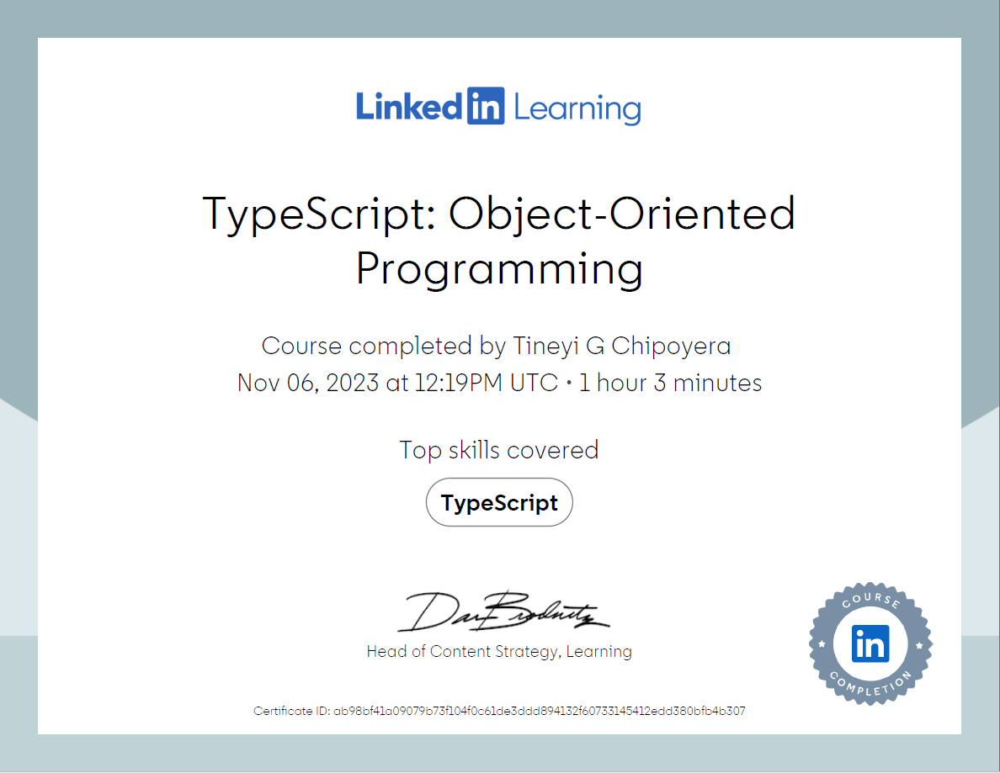
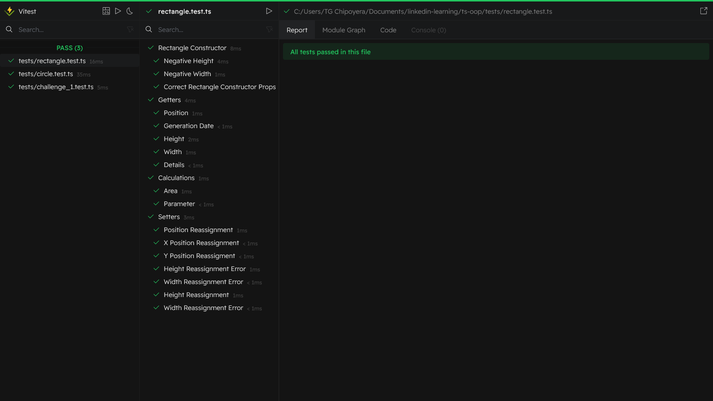

# Typescript Object Orientated Programming

## Table of Content

## Resources

- [Course](https://www.linkedin.com/learning/typescript-object-oriented-programming/)
- [Vite](https://vitejs.dev/)
- [Vitest](https://vitest.dev/)
- [Typescript](https://www.typescriptlang.org/)
- [Google TypeScript Style](https://google.github.io/styleguide/tsguide.html)
- [VSCode](https://code.visualstudio.com/)

## Introduction

[certificate](https://www.linkedin.com/learning/certificates/ab98bf41a09079b73f104f0c61de3ddd894132f60733145412edd380bfb4b307)

[](https://www.linkedin.com/learning/certificates/ab98bf41a09079b73f104f0c61de3ddd894132f60733145412edd380bfb4b307)

This is largely based on the [Typescript Object Orientated Programming](https://www.linkedin.com/learning/typescript-object-oriented-programming/) course that is on [LinkedIn Learning](https://www.linkedin.com/learning/). I already have experience with typescript, so the course wasn't challenging. The only thing I did not understanding is the difference between `extends` & `implements`

The more exciting thing for me was the this was the first time learning & using a testing framework.

The following concepts were covered:

- Classes & Objects
- Constructor & class properties
- Methods
- Getters & Setters
- Inheritance
- Polymorphism
- Encapsulation
- Accessability modifiers

## Setup

### Vite

The reason why I used vite is because I didn't want to install [typescript](https://www.typescriptlang.org/) & manually configure it, make changges to the package.json scripts etc... Honestly I was just feeling lazy. So I looked for something that would just provided full trypescript support from the word go.

running the following command

```bash
npm create vite@latest
```

will result in [vite](https://vitejs.dev/) asking us what type of project we would like to initialise. I simply picked vanilla with typescript, & it generated the everything needed for the prooject.

### Google Typescript Style

I eventaully installed [Google TypeScript Style](https://google.github.io/styleguide/tsguide.html) because I didn't want to worry about how the code looked, I just wanted a linter that will force consistency. Unfortunately, I noticed that my Prettier extension in VSCode wasn't formatting after installation of [gts](https://google.github.io/styleguide/tsguide.html)

### Vitest

I recently experienced testing in java applications, that made me realise the importance of testing. Unlike manually testing, which I used to do 🥲, test are like scripts that test your code. In this case, it was unit testing. I majorly tested on the Rectangle & Circle class.

The test framework I used was [Vitest](https://vitest.dev/) because of 2 reasons:

- It supports ES Modules right out of the ox, with no configuration required.
- It supports Typescript right out of the ox, with no configuration required.

#### Vitest UI



Another thing I loved about about [Vitest](https://vitest.dev/) is the [Vitest ui](https://vitest.dev/guide/ui.html).

> Powered by Vite, Vitest also has a dev server under the hood when running the tests. This allows Vitest to provide a beautiful UI to view and interact with your tests

It was cool to work with [Vitest ui](https://vitest.dev/guide/ui.html), but I didn't take time to find a way to integrate [Vitest ui](https://vitest.dev/guide/ui.html) with my text editor ([VSCode](https://code.visualstudio.com/))

## OOP

This was pretty basic, especially since I've been dealing with these concepts at school & in my own free time through my personal projects and/or reading about. The basic explanation I was taught is,

> A class is like a blueprint, the object is the actual thing.

The classes [UserClass](./src/challenge_1.ts), [Admin](./src/challenge_2.ts), [Shape](./src/inheritance_playground/shape.ts), [Rectangle](./src/inheritance_playground/rectangle.ts), [Circle](./src/inheritance_playground/circle.ts). You will find the objects in the [main](./src/main.ts), [challenge.test](./tests/challenge_1.test.ts), [circle.test](./tests/circle.test.ts) & [rectangle.test](./tests/rectangle.test.ts)

Unlike the course, I decided to use objects for the constructors, I thought it was easier passing an object to the constructor, because in works like named parameters, which makes it easier to work with in my opinion.

I also experimented with my own classes ([Shape](./src/inheritance_playground/shape.ts), [Rectangle](./src/inheritance_playground/rectangle.ts), [Circle ](./src/inheritance_playground/circle.ts)) because I wanted to revise OOP concepts with my own scenario (using shapes).

Each class had getters and setters for each property. Each class also had their own methods, & you'll notice that [Rectangle](./src/inheritance_playground/rectangle.ts), [Circle ](./src/inheritance_playground/circle.ts) also override a few methods from the parent class [Shape](./src/inheritance_playground/shape.ts).

I displayed polymorphism in the [main.ts](./src/main.ts).

A few other concepts from the [course](https://www.linkedin.com/learning/typescript-object-oriented-programming/) were also covered.

## Test cases

<!-- Prettier extension not working anymore -->

<!--
I just finished the course “TypeScript: Object-Oriented Programming” by Dylan Israel! Check it out: https://www.linkedin.com/learning/certificates/ab98bf41a09079b73f104f0c61de3ddd894132f60733145412edd380bfb4b307?trk=share_certificate #typescript.
 -->
